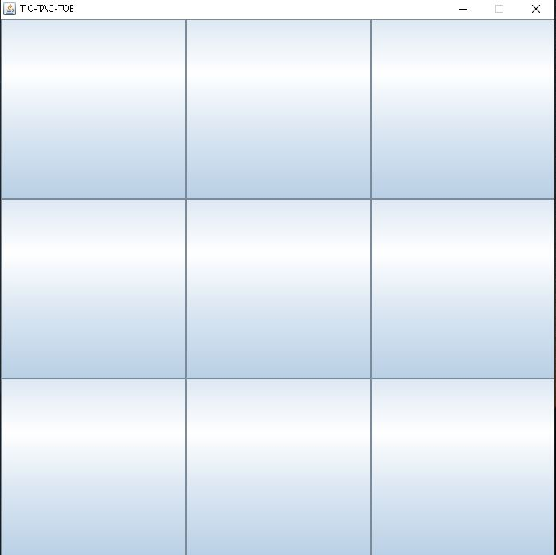

# java-swing-tic-tac-toe

Este proyecto es modo consola.

## Pre Requisitos 🚀

1. Instalar Windows 10
2. Instalar Java 1.8.0_201
3. Instalar Gradle 4.4 

## Instalacion 🔧

1. Clonar Repositorio: `https://github.com/RichardSeverich/java-tic-tac-toe.git`
2. Generar el JAR: `gradle build`
3. Iniciar programa: `java -jar build/libs/java-tic-tac-toe.jar`

## Documentacion

## UI

### TIC TAC TOE

  

### START PLAY

  

### DIFFERENT COLORS  BETWEEN PLAYER 1 AND 2

  

  

### TIE

  

### WINNER

  

